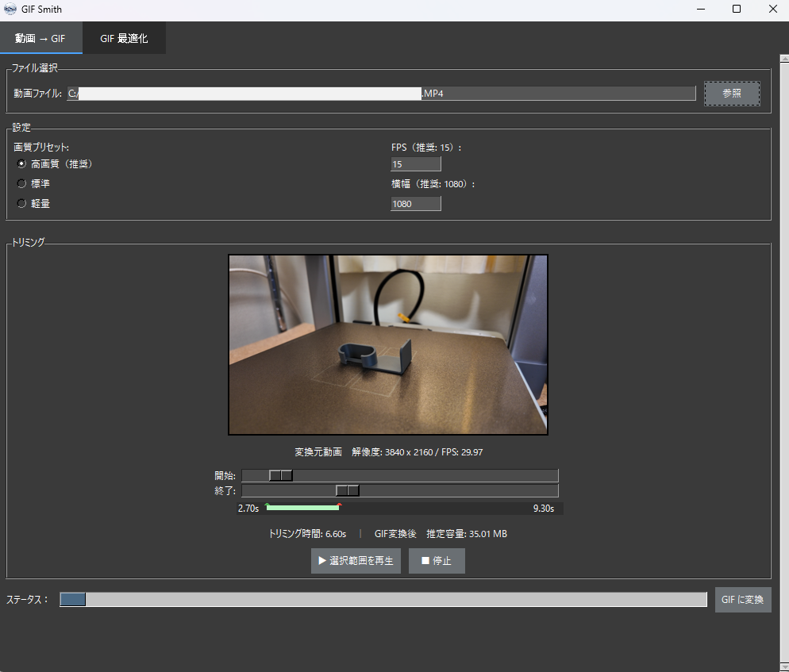
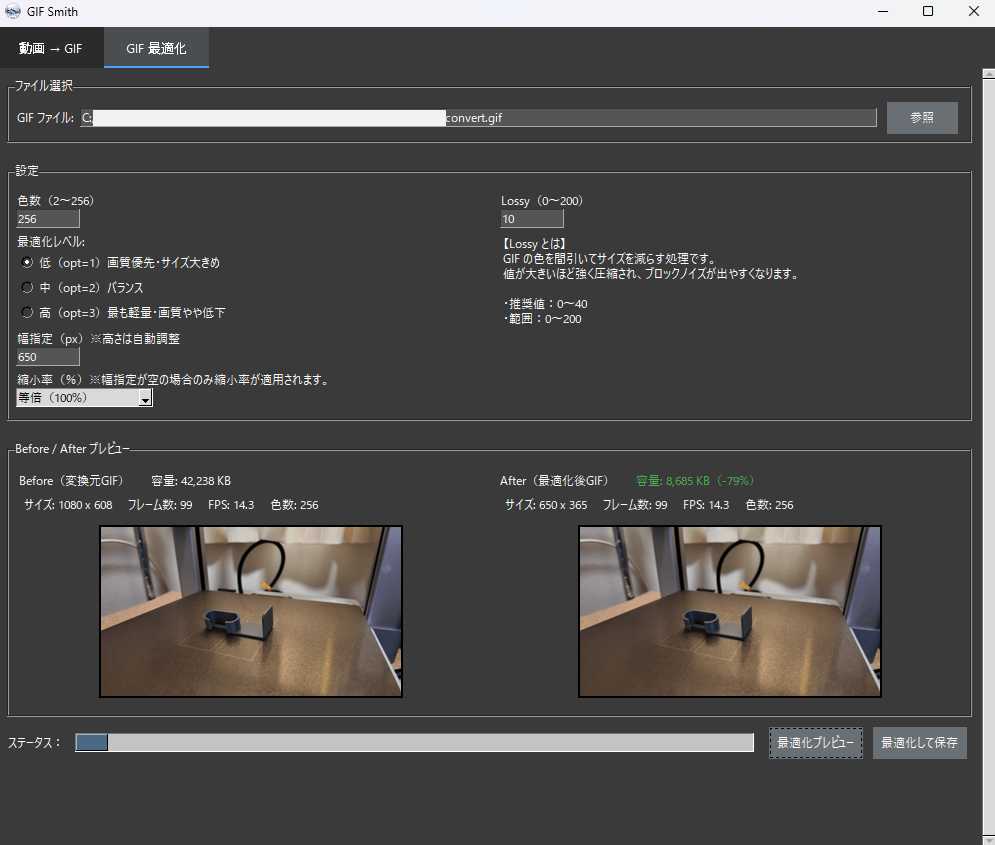

📘 GIFSmith – Video → GIF Converter & GIF Optimizer  

  
GIFSmith is a lightweight desktop application that allows you to
convert videos into GIFs easily and optimize existing GIF files.
It includes trimming, FPS/size adjustment, preview, and optimization features —
everything you need for GIF creation in one tool.

🚀 Features  
🎞 1. Video → GIF Conversion  
-Trim start/end positions  
-Set FPS and output width  
-Preview before exporting  
-Estimated file size (rough estimate)  
🧹 2. GIF Optimization  
-Color palette optimization  
-GIF compression  
-Resize GIFs  
-Preview optimized result  
-Estimated file size (high accuracy)  

🖼Screenshots  
This screen allows you to load a video, set the trimming range, FPS, and output width, and generate a GIF.  
  
This screen lets you optimize an existing GIF by adjusting color count, compression level, width, and lossy settings.  
 

📦 Required Files  
Place the following executables in the same folder as GIFSmith.exe:  
-ffmpeg.exe — Extract frames from video  
 => https://www.gyan.dev/ffmpeg/builds/  
-ffprobe.exe — Retrieve video metadata  
 => Included in the FFmpeg ZIP  
-gifsicle.exe — Optimize GIF files  
 => https://eternallybored.org/misc/gifsicle/  

📁 Folder Structure  
GIFSmith/  
├─ GIFSmith.exe  
├─ ffmpeg.exe  
├─ ffprobe.exe  
└─ gifsicle.exe  

🖥️ How to Use  
1. Video → GIF Conversion  
  Open the Video → GIF tab  
  Select a video file  
  Set trimming range  
  Adjust FPS and width  
  Click Create GIF  
2. GIF Optimization  
  Open the GIF Optimization tab  
  Select a GIF file  
  Adjust compression and size  
  Click Optimize & Save  

🔧 System Requirements  
Windows 10 / 11  
No installation required (standalone EXE)  
ffmpeg.exe / ffprobe.exe / gifsicle.exe must be in the same folder  

📄 License  
This application is intended for personal use.  
ffmpeg / ffprobe / gifsicle follow their respective licenses.  

✨ Author  
mege  
Developer of GIFSmith
